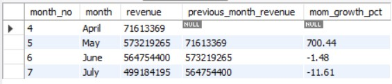
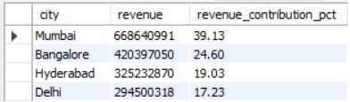
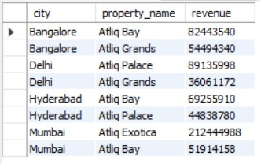
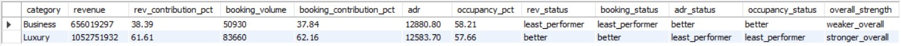

# 🏨 __AtliQ Grands Revenue Intelligence & Optimization – SQL Analytics Project__

## __Overview__

The hospitality industry operates on thin margins, where small changes in occupancy, pricing, cancellations, and customer satisfaction can have a significant impact on overall profitability. This project analyzes the business performance of AtliQ Grands, a hotel chain facing declining revenue and market share. Using MySQL, I conducted an in-depth analysis of operational and financial data to uncover actionable insights aimed at improving revenue, optimizing occupancy, and enhancing customer experience.

Through structured SQL analysis, the project examines:
* Revenue trends and city-level performance
* Occupancy and capacity utilization
*	Booking platform effectiveness
*	Cancellation revenue impact
*	Customer ratings and service quality
*	Executive KPIs including ADR, RevPAR, and Occupancy Rate

Beyond writing queries, the focus of this project was to think like a business analyst, not just extracting data but translating it into meaningful insights that support strategic decision-making.

This case study demonstrates advanced SQL capabilities such as aggregations, joins, CTEs, window functions, ranking, and KPI calculations, applied to a real-world hospitality analytics scenario.

## __Dataset Summary: The Foundation of Our Analysis__

The dataset is structured using a star-schema architecture optimized for analytical querying. It contains 134,590 booking-level records stored in the central fact table fact_bookings, capturing individual reservation attributes such as booking dates, room types, prices, stay duration, booking status, and customer ratings.An additional fact table, fact_aggregated_bookings, stores pre-aggregated daily metrics related to room capacity, successful bookings, and occupancy counts, enabling efficient KPI computation. The schema is supported by dimension tables for Hotels, Rooms, and Date, providing descriptive context and temporal hierarchies for analysis. This data model is designed to support high-performance SQL analytics, enabling complex joins, time-based calculations, and scalable metric evaluation across multiple business dimensions.

## __Star Schema Data Model__


## 📊 __SQL Analysis & Key Business Insights__

__1.What is the total revenue generated during the analysis period?__

```
SELECT
	SUM(revenue_realised) AS total_revenue_realized
FROM fact_bookings;
```
__Result__


#### Total Revenue Realized by AtliQ Grands: $1.71 Billion (during the analysis period)

__2.How does monthly revenue trend evolve? (MoM growth & decline %)__

```
WITH monthly_revenue AS (
    SELECT
        MONTH(booking_date) AS month_no,
        MONTHNAME(booking_date) AS month,
        SUM(revenue_realised) AS revenue
    FROM fact_bookings
    GROUP BY month_no, month
)
SELECT
    month_no,
    month,
    revenue,
    LAG(revenue) OVER (ORDER BY month_no) AS previous_month_revenue,
    ROUND(
        ((revenue - LAG(revenue) OVER (ORDER BY month_no)) 
        / LAG(revenue) OVER (ORDER BY month_no)) * 100,
        2
    ) AS mom_growth_pct
FROM monthly_revenue
ORDER BY month_no;
```

__Result__



#### Monthly revenue surged significantly in May (700.44% growth), followed by a slight dip in June (-1.48%) and a sharper decline in July (-11.61%), indicating weakening momentum after the May peak.

__3.What is the revenue contribution (%) by each city?__

```
SELECT
    dh.city,
    SUM(fb.revenue_realised) AS revenue,
    ROUND(
        (SUM(fb.revenue_realised) /
        (SELECT SUM(revenue_realised)
         FROM fact_bookings)
        ) * 100,2
    ) AS revenue_contribution_pct
FROM dim_hotels AS dh
JOIN fact_bookings AS fb
ON dh.property_id = fb.property_id
GROUP BY dh.city
ORDER BY revenue DESC;
```
__Result__



#### Mumbai is the dominant revenue driver, contributing 39% of total revenue, while Bangalore and Hyderabad together account for over 43%, indicating strong multi-city dependence.

__4.Which hotels contribute the most and least revenue within each city?__

```
WITH hotel_revenue AS (
    SELECT
        dh.property_name,
        dh.city,
        SUM(fb.revenue_realised) AS revenue
    FROM dim_hotels AS dh
    JOIN fact_bookings AS fb
	ON dh.property_id = fb.property_id
    GROUP BY dh.property_name, dh.city
),
ranked_hotels AS 
(
    SELECT
        *,
        RANK() OVER (PARTITION BY city ORDER BY revenue DESC) AS rank_desc,
        RANK() OVER (PARTITION BY city ORDER BY revenue ASC) AS rank_asc
    FROM hotel_revenue
)

SELECT 
	city,
    property_name,
    revenue
FROM ranked_hotels
WHERE rank_desc = 1 OR rank_asc = 1
ORDER BY city, revenue DESC;
```

__Result__



#### In Bangalore, AtliQ Bay generates significantly higher revenue than AtliQ Grands, making it the city’s top contributor. In Delhi, AtliQ Palace leads revenue performance, while AtliQ Grands contributes the least within the city. Similarly, in Hyderabad, AtliQ Bay outperforms AtliQ Palace, and in Mumbai, AtliQ Exotica stands out as the dominant revenue driver, with AtliQ Bay generating comparatively lower revenue. Overall, revenue contribution varies notably across properties within each city, indicating potential differences in pricing strategy, customer demand, or market positioning.

__5.Compare Luxury and Business hotel categories across key performance metrics, including total revenue, booking volume, occupancy percentage, and Average Daily Rate (ADR). Additionally, calculate each category’s contribution percentage to total revenue and total bookings.
Identify the least-performing category for each metric and compare ADR between the two categories. Finally, explain which category performs stronger overall and justify the conclusion using the observed metrics.


```
WITH metrics1 AS
(
	SELECT
		dh.category,
        SUM(fb.revenue_realised) AS revenue,
        COUNT(fb.booking_id) AS booking_volume,
        ROUND(
			SUM(fb.revenue_realised)/COUNT(fb.booking_id),2
            ) AS adr
	FROM dim_hotels AS dh
    JOIN fact_bookings AS fb
    ON dh.property_id = fb.property_id
    GROUP BY dh.category
),
metrics2 AS
(
	SELECT
		dh.category,
        ROUND(
			(SUM(fab.successful_bookings)/SUM(fab.capacity))*100,2
            )AS occupancy_pct
	FROM dim_hotels AS dh
    JOIN fact_aggregated_bookings AS fab
    ON dh.property_id = fab.property_id
    GROUP BY dh.category
)
SELECT
	m1.category,
    m1.revenue,
    ROUND(
		m1.revenue * 100/ SUM(m1.revenue) OVER(),2
        ) AS rev_contribution_pct,
    m1.booking_volume,
    ROUND(
		m1.booking_volume * 100/ SUM(m1.booking_volume) OVER(),2
        ) AS booking_contribution_pct,
    m1.adr,
    m2.occupancy_pct,
    CASE WHEN m1.revenue = MIN(m1.revenue) OVER()
		THEN 'least_performer' ELSE 'better' END AS rev_status,
	CASE WHEN m1.booking_volume = MIN(m1.booking_volume) OVER()
		THEN 'least_performer' ELSE 'better' END AS booking_status,
	CASE WHEN m1.adr = MIN(m1.adr) OVER()
		THEN 'least_performer' ELSE 'better' END AS adr_status,
	CASE WHEN m2.occupancy_pct = MIN(m2.occupancy_pct) OVER()
		THEN 'least_performer' ELSE 'better' END AS occupancy_status,
	CASE WHEN m1.revenue = MAX(m1.revenue) OVER ()
         THEN 'stronger_overall'
         ELSE 'weaker_overall' END AS overall_strength
FROM metrics1 AS m1
JOIN metrics2 AS m2
ON m1.category = m2.category
ORDER BY m1.category;
```

__Result__



#### Luxury hotels outperform Business hotels in overall financial performance, generating 61.61% of total revenue and contributing 62.16% of total bookings, compared to Business hotels at 38.39% revenue and 37.84% bookings. Although Business hotels achieve a slightly higher ADR (12,880.80 vs. 12,583.70) and marginally better occupancy (58.21% vs. 57.66%), they underperform in both total revenue and booking volume. Luxury hotels, despite having a lower ADR and occupancy rate, benefit from stronger demand and higher booking contribution, making them the stronger overall category. Business hotels emerge as the least-performing category in revenue and booking contribution, while Luxury lags slightly in ADR and occupancy efficiency.
