# 🏨 __AtliQ Grands Revenue Intelligence & Optimization – SQL Analytics Project__

## __Overview__

The hospitality industry operates on thin margins, where small changes in occupancy, pricing, cancellations, and customer satisfaction can have a significant impact on overall profitability. This project analyzes the business performance of AtliQ Grands, a hotel chain facing declining revenue and market share. Using MySQL, I conducted an in-depth analysis of operational and financial data to uncover actionable insights aimed at improving revenue, optimizing occupancy, and enhancing customer experience.

Through structured SQL analysis, the project examines:
* Revenue trends and city-level performance
* Occupancy and capacity utilization
*	Booking platform effectiveness
*	Cancellation revenue impact
*	Customer ratings and service quality
*	Executive KPIs including ADR, RevPAR, and Occupancy Rate

Beyond writing queries, the focus of this project was to think like a business analyst, not just extracting data but translating it into meaningful insights that support strategic decision-making.

This case study demonstrates advanced SQL capabilities such as aggregations, joins, CTEs, window functions, ranking, and KPI calculations, applied to a real-world hospitality analytics scenario.

## __Dataset Summary: The Foundation of Our Analysis__

The dataset is structured using a star-schema architecture optimized for analytical querying. It contains 134,590 booking-level records stored in the central fact table fact_bookings, capturing individual reservation attributes such as booking dates, room types, prices, stay duration, booking status, and customer ratings.An additional fact table, fact_aggregated_bookings, stores pre-aggregated daily metrics related to room capacity, successful bookings, and occupancy counts, enabling efficient KPI computation. The schema is supported by dimension tables for Hotels, Rooms, and Date, providing descriptive context and temporal hierarchies for analysis. This data model is designed to support high-performance SQL analytics, enabling complex joins, time-based calculations, and scalable metric evaluation across multiple business dimensions.

## __Star Schema Data Model__


## 📊 __SQL Analysis & Key Business Insights__

1️⃣ __What is the total revenue generated during the analysis period?__

```
SELECT
	SUM(revenue_realised) AS total_revenue_realized
FROM fact_bookings;
```
__Result__


#### Total Revenue Realized by AtliQ Grands: $1.71 Billion (during the analysis period)

2️⃣ __How does monthly revenue trend evolve? (MoM growth & decline %)__

```
WITH monthly_revenue AS (
    SELECT
        MONTH(booking_date) AS month_no,
        MONTHNAME(booking_date) AS month,
        SUM(revenue_realised) AS revenue
    FROM fact_bookings
    GROUP BY month_no, month
)
SELECT
    month_no,
    month,
    revenue,
    LAG(revenue) OVER (ORDER BY month_no) AS previous_month_revenue,
    ROUND(
        ((revenue - LAG(revenue) OVER (ORDER BY month_no)) 
        / LAG(revenue) OVER (ORDER BY month_no)) * 100,
        2
    ) AS mom_growth_pct
FROM monthly_revenue
ORDER BY month_no;
```

__Result__


#### Monthly revenue surged significantly in May (700.44% growth), followed by a slight dip in June (-1.48%) and a sharper decline in July (-11.61%), indicating weakening momentum after the May peak.

3️⃣ __What is the revenue contribution (%) by each city?__

```
SELECT
    dh.city,
    SUM(fb.revenue_realised) AS revenue,
    ROUND(
        (SUM(fb.revenue_realised) /
        (SELECT SUM(revenue_realised)
         FROM fact_bookings)
        ) * 100,2
    ) AS revenue_contribution_pct
FROM dim_hotels AS dh
JOIN fact_bookings AS fb
ON dh.property_id = fb.property_id
GROUP BY dh.city
ORDER BY revenue DESC;
```
__Result__


#### Mumbai is the dominant revenue driver, contributing 39% of total revenue, while Bangalore and Hyderabad together account for over 43%, indicating strong multi-city dependence.

4️⃣ __Which hotels contribute the most and least revenue within each city?__

```
WITH hotel_revenue AS (
    SELECT
        dh.property_name,
        dh.city,
        SUM(fb.revenue_realised) AS revenue
    FROM dim_hotels AS dh
    JOIN fact_bookings AS fb
	ON dh.property_id = fb.property_id
    GROUP BY dh.property_name, dh.city
),
ranked_hotels AS 
(
    SELECT
        *,
        RANK() OVER (PARTITION BY city ORDER BY revenue DESC) AS rank_desc,
        RANK() OVER (PARTITION BY city ORDER BY revenue ASC) AS rank_asc
    FROM hotel_revenue
)

SELECT 
	city,
    property_name,
    revenue
FROM ranked_hotels
WHERE rank_desc = 1 OR rank_asc = 1
ORDER BY city, revenue DESC;
```

__Result__


#### In Bangalore, AtliQ Bay generates significantly higher revenue than AtliQ Grands, making it the city’s top contributor. In Delhi, AtliQ Palace leads revenue performance, while AtliQ Grands contributes the least within the city. Similarly, in Hyderabad, AtliQ Bay outperforms AtliQ Palace, and in Mumbai, AtliQ Exotica stands out as the dominant revenue driver, with AtliQ Bay generating comparatively lower revenue. Overall, revenue contribution varies notably across properties within each city, indicating potential differences in pricing strategy, customer demand, or market positioning.

5️⃣ __Compare Luxury and Business hotel categories across key performance metrics, including total revenue, booking volume, occupancy percentage, and Average Daily Rate (ADR). Additionally, calculate each category’s contribution percentage to total revenue and total bookings. Identify the least-performing category for each metric and compare ADR between the two categories. Finally, explain which category performs stronger overall and justify the conclusion using the observed metrics.__

```
WITH metrics1 AS
(
	SELECT
		dh.category,
        SUM(fb.revenue_realised) AS revenue,
        COUNT(fb.booking_id) AS booking_volume,
        ROUND(
			SUM(fb.revenue_realised)/COUNT(fb.booking_id),2
            ) AS adr
	FROM dim_hotels AS dh
    JOIN fact_bookings AS fb
    ON dh.property_id = fb.property_id
    GROUP BY dh.category
),
metrics2 AS
(
	SELECT
		dh.category,
        ROUND(
			(SUM(fab.successful_bookings)/SUM(fab.capacity))*100,2
            )AS occupancy_pct
	FROM dim_hotels AS dh
    JOIN fact_aggregated_bookings AS fab
    ON dh.property_id = fab.property_id
    GROUP BY dh.category
)
SELECT
	m1.category,
    m1.revenue,
    ROUND(
		m1.revenue * 100/ SUM(m1.revenue) OVER(),2
        ) AS rev_contribution_pct,
    m1.booking_volume,
    ROUND(
		m1.booking_volume * 100/ SUM(m1.booking_volume) OVER(),2
        ) AS booking_contribution_pct,
    m1.adr,
    m2.occupancy_pct,
    CASE WHEN m1.revenue = MIN(m1.revenue) OVER()
		THEN 'least_performer' ELSE 'better' END AS rev_status,
	CASE WHEN m1.booking_volume = MIN(m1.booking_volume) OVER()
		THEN 'least_performer' ELSE 'better' END AS booking_status,
	CASE WHEN m1.adr = MIN(m1.adr) OVER()
		THEN 'least_performer' ELSE 'better' END AS adr_status,
	CASE WHEN m2.occupancy_pct = MIN(m2.occupancy_pct) OVER()
		THEN 'least_performer' ELSE 'better' END AS occupancy_status,
	CASE WHEN m1.revenue = MAX(m1.revenue) OVER ()
         THEN 'stronger_overall'
         ELSE 'weaker_overall' END AS overall_strength
FROM metrics1 AS m1
JOIN metrics2 AS m2
ON m1.category = m2.category
ORDER BY m1.category;
```

__Result__


#### Luxury hotels outperform Business hotels in overall financial performance, generating 61.61% of total revenue and contributing 62.16% of total bookings, compared to Business hotels at 38.39% revenue and 37.84% bookings. Although Business hotels achieve a slightly higher ADR (12,880.80 vs. 12,583.70) and marginally better occupancy (58.21% vs. 57.66%), they underperform in both total revenue and booking volume. Luxury hotels, despite having a lower ADR and occupancy rate, benefit from stronger demand and higher booking contribution, making them the stronger overall category. Business hotels emerge as the least-performing category in revenue and booking contribution, while Luxury lags slightly in ADR and occupancy efficiency.

6️⃣ __What is the overall occupancy rate, and how does it vary by city?__

```
SELECT
	COALESCE(dh.city,'Overall') AS city,
    ROUND(
		(SUM(fab.successful_bookings)/SUM(fab.capacity))*100,2)
        AS occupancy_rate 
FROM dim_hotels AS dh
JOIN fact_aggregated_bookings AS fab
ON dh.property_id = fab.property_id
GROUP BY dh.city WITH ROLLUP
ORDER BY CASE WHEN dh.city IS NULL THEN 0 ELSE 1 END, occupancy_rate DESC;
```

__Result__

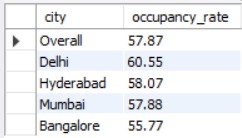

#### The overall occupancy rate stands at 57.87%, indicating that slightly more than half of the total room capacity is utilized on average. Among the cities, Delhi records the highest occupancy rate at 60.55%, reflecting comparatively stronger demand. Hyderabad (58.07%) and Mumbai (57.88%) remain close to the overall average, showing stable performance. In contrast, Bangalore has the lowest occupancy rate at 55.77%, suggesting relatively weaker room utilization and potential scope for demand improvement.

7️⃣ __Which hotels are under-utilized (low occupancy vs high capacity)?__

```
WITH hotel_metrics AS
(
	SELECT
		dh.property_id,
		dh.property_name AS hotels,
		ROUND(
			(SUM(fab.successful_bookings)/SUM(fab.capacity))*100,2)
        AS occupancy_rate ,
		SUM(fab.capacity) AS capacity
	FROM dim_hotels AS dh
	JOIN fact_aggregated_bookings AS fab
	ON dh.property_id = fab.property_id
	GROUP BY dh.property_id, dh.property_name
),
average_capacity AS
(
	SELECT
		AVG(capacity) AS avg_capacity
	FROM hotel_metrics
)
SELECT
	hm.hotels,
    hm.occupancy_rate,
    hm.capacity,
    CASE WHEN hm.occupancy_rate < 50 AND hm.capacity >= ac.avg_capacity 
			THEN 'underutilized' ELSE 'ok' END AS utilization_status
FROM hotel_metrics AS hm
CROSS JOIN average_capacity AS ac
ORDER BY hm.occupancy_rate, hm.capacity DESC;
```

__Result__

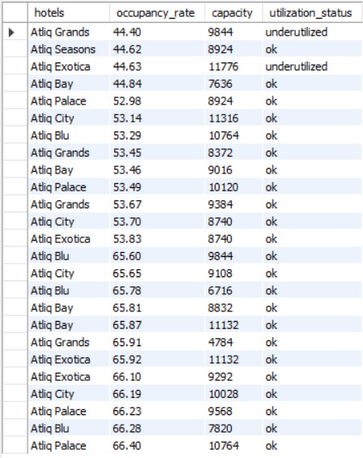

#### The analysis shows that AtliQ Grands (44.40% occupancy, capacity 9,844) and AtliQ Exotica (44.63% occupancy, capacity 11,776) are under-utilized, as they maintain relatively low occupancy rates despite having high room capacity. Their large inventory combined with weak room utilization indicates demand gaps or pricing inefficiencies. In contrast, most other hotels operate above 50% occupancy with “ok” utilization status, suggesting comparatively better capacity management. These under-utilized properties may require targeted marketing, pricing adjustments, or demand stimulation strategies to improve performance.

8️⃣ __How does occupancy differ by: o Room class o Weekday vs Weekend__

```
SELECT
	dr.room_class,
	dd.day_type,
	ROUND(
			(SUM(fab.successful_bookings)/SUM(fab.capacity))*100,2)
	AS occupancy_pct
FROM dim_date_clean AS dd
JOIN fact_aggregated_bookings AS fab
ON dd.date = STR_TO_DATE(fab.check_in_date,'%d-%b-%Y')
JOIN dim_rooms AS dr
ON fab.room_category = dr.room_id
GROUP BY dr.room_class, dd.day_type;
```

__Result__

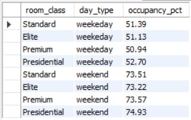

#### Occupancy rates are relatively similar across all room classes on weekdays, ranging between 50–53%, with Presidential rooms slightly leading at 52.70% and Premium being the lowest at 50.94%. However, a significant increase is observed during weekends, where occupancy rises sharply to 73–75% across all categories. Presidential rooms again record the highest weekend occupancy (74.93%), while Standard and Elite rooms also perform strongly above 73%. Overall, demand is clearly stronger on weekends across every room class, indicating leisure-driven booking patterns rather than class-specific demand differences.

9️⃣ __Which hotels perform below their city’s average occupancy?__

```
WITH hotel_metrics AS
(
	SELECT
		dh.property_id,
        dh.property_name,
        dh.city,
		ROUND(
				(SUM(fab.successful_bookings)/SUM(fab.capacity))*100,2)
		AS hotel_occupancy
	FROM dim_hotels AS dh
	JOIN fact_aggregated_bookings AS fab
	ON dh.property_id = fab.property_id
    GROUP BY dh.property_id, dh.property_name, dh.city
),
city_metrics AS
(
	SELECT
		city,
		ROUND(AVG(hotel_occupancy),2) AS city_avg_occupancy
	FROM hotel_metrics 
    GROUP BY city
)
SELECT
	h.property_name,
    h.hotel_occupancy,
    c.city,
    c.city_avg_occupancy
FROM hotel_metrics AS h
JOIN city_metrics AS c
ON h.city = c.city
WHERE h.hotel_occupancy < c.city_avg_occupancy
ORDER BY h.city, h.hotel_occupancy;
```

__Result__

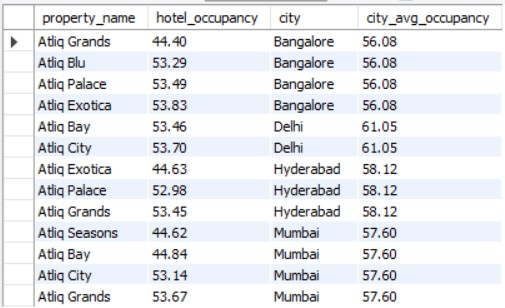

#### The analysis indicates that several properties operate below their respective city’s average occupancy. In Bangalore (city average: 56.08%), AtliQ Grands (44.40%), AtliQ Blu (53.29%), AtliQ Palace (53.49%), and AtliQ Exotica (53.83%) fall short of the benchmark. In Delhi (61.05%), AtliQ Bay (53.46%) and AtliQ City (53.70%) underperform relative to the city average. In Hyderabad (58.12%), AtliQ Exotica (44.63%), AtliQ Palace (52.98%), and AtliQ Grands (53.45%) remain below average. Similarly, in Mumbai (57.60%), AtliQ Seasons (44.62%), AtliQ Bay (44.84%), and AtliQ City (53.14%) underperform, highlighting potential demand or operational challenges in these properties.

🔟 __10.What is the revenue contribution and booking share by each platform?__

```
SELECT
	booking_platform,
    ROUND(
		(COUNT(booking_id)/SUM(COUNT(booking_id)) OVER() * 100),2
        )AS booking_share_pct,
    ROUND(
		(SUM(revenue_realised)/SUM(SUM(revenue_realised)) OVER() * 100),2
        )AS revenue_pct
FROM fact_bookings
GROUP BY booking_platform
ORDER BY booking_share_pct DESC;
```

__Result__

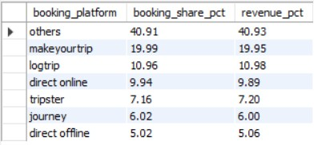

#### The “Others” category dominates both booking share (40.91%) and revenue contribution (40.93%), indicating a significant portion of demand comes from aggregated or unclassified channels. Among identified platforms, MakeYourTrip leads with nearly 20% contribution in both bookings (19.99%) and revenue (19.95%), followed by LogTrip (~11%) and Direct Online (~10%). Platforms like Tripster (7.16%), Journey (6.02%), and Direct Offline (5.02%) contribute comparatively smaller shares. Overall, revenue distribution closely mirrors booking share across platforms, suggesting consistent pricing performance without major ADR variation by channel.

1️⃣1️⃣ __Which platforms show high cancellation rates, and how do they impact revenue?__

```
SELECT
	booking_platform,
    ROUND(
    (SUM(CASE WHEN booking_status='Cancelled' THEN 1 ELSE 0 END) /
    COUNT(booking_id))*100,2
    ) AS cancellation_rate,
    ROUND(
    SUM(CASE WHEN booking_status='Cancelled' THEN
    (revenue_generated - revenue_realised) ELSE 0 END),2 
    )AS revenue_lost_for_cancellation
FROM fact_bookings
GROUP BY booking_platform
ORDER BY cancellation_rate DESC;
```

__Result__

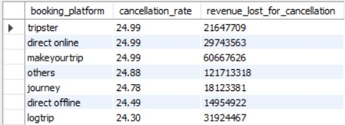

#### Cancellation rates are consistently high across all platforms, hovering around 24–25%, with Tripster, Direct Online, and MakeYourTrip recording the highest rate at 24.99%. However, the financial impact varies significantly by booking volume. The “Others” category experiences the greatest revenue loss due to cancellations (≈121.7M), followed by MakeYourTrip (≈60.7M) and Direct Online (≈29.7M), reflecting their larger booking base. In contrast, platforms like Journey, Direct Offline, and LogTrip show comparatively lower revenue loss despite similar cancellation rates. Overall, while cancellation percentages are similar across channels, revenue impact is primarily driven by platform scale and booking volume rather than rate differences alone.

1️⃣2️⃣ __Which platform generates the highest revenue per booking?__

```
SELECT
	booking_platform,
    ROUND(
    SUM(revenue_realised)/ COUNT(booking_id),2
    ) AS revenue_per_booking
FROM fact_bookings
GROUP BY booking_platform
ORDER BY revenue_per_booking DESC;
```

__Result__

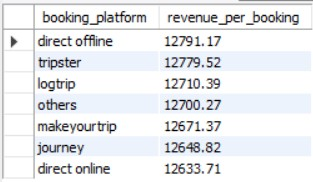

#### Direct Offline generates the highest revenue per booking at 12,791.17, slightly outperforming Tripster (12,779.52) and LogTrip (12,710.39). Although the differences across platforms are relatively small, Direct Offline bookings appear to yield marginally higher value per transaction. In contrast, Direct Online records the lowest revenue per booking (12,633.71), suggesting slightly lower pricing or customer spending through that channel. Overall, ADR performance remains fairly consistent across platforms with minimal variation.

1️⃣3️⃣ __What is the distribution of booking status? (Checked-out, Cancelled, No-show)__

```
SELECT
	booking_status,
    COUNT(booking_id) AS booking_count,
    ROUND(
		(COUNT(booking_id) / SUM(COUNT(booking_id)) OVER()) * 100,2
    ) AS booking_pct
FROM fact_bookings
GROUP BY booking_status
ORDER BY booking_pct DESC;
```

__Result__

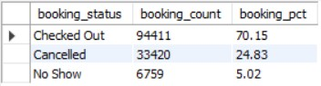

#### The majority of bookings are successfully checked out, accounting for 70.15% (94,411 bookings), indicating a strong conversion from reservation to stay. However, a significant 24.83% (33,420 bookings) are cancelled, representing a substantial operational and revenue risk. Additionally, 5.02% (6,759 bookings) fall under no-shows, which further impacts occupancy efficiency. Overall, while most bookings materialize into completed stays, nearly 30% of reservations do not convert, highlighting the need for stronger cancellation and no-show management strategies.

1️⃣4️⃣ __How much revenue is lost due to cancellations?__

```
SELECT
	booking_status,
	SUM(revenue_generated) - SUM(revenue_realised) AS revenue_lost,
    ROUND(
		((SUM(revenue_generated) - SUM(revenue_realised)) / SUM(revenue_generated) )* 100,2
    ) AS revenue_lost_pct
FROM fact_bookings
WHERE booking_status = 'Cancelled'
GROUP BY booking_status ;
```

__Result__

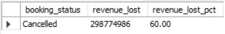

#### The analysis shows that 29,877,4986 (≈298.77M) in revenue is lost due to cancellations, accounting for 60% of total lost revenue. This indicates that cancellations are the primary driver of revenue leakage, significantly impacting overall profitability. The high loss proportion highlights the need for stronger cancellation policies, advance deposits, or predictive demand management strategies to minimize financial impact.

1️⃣5️⃣ __Which city and room type have the highest cancellation impact?__

```
SELECT
	dh.city,
    dr.room_class,
    ROUND(SUM(fb.revenue_generated) - SUM(fb.revenue_realised), 2) AS revenue_lost_amt,
    ROUND(
		((SUM(fb.revenue_generated) - SUM(fb.revenue_realised)) / SUM(fb.revenue_generated) )* 100,2
    ) AS revenue_lost_pct
FROM dim_hotels AS dh
JOIN fact_bookings AS fb
ON dh.property_id = fb.property_id
JOIN dim_rooms AS dr
ON fb.room_category = dr.room_id
WHERE fb.booking_status = 'Cancelled'
GROUP BY dh.city, dr.room_class
ORDER BY revenue_lost_amt DESC
LIMIT 1;
```

__Result__

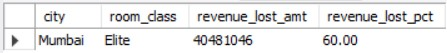

#### The analysis shows that Mumbai – Elite room class experiences the highest cancellation impact, with a revenue loss of 40,481,046, accounting for 60% of the total lost revenue in that segment. This indicates that high-value Elite bookings in Mumbai are particularly vulnerable to cancellations. Given the premium positioning of this room category, such losses can significantly affect profitability, suggesting a need for stricter cancellation policies or advance payment strategies for this segment.

1️⃣6️⃣ __What is the average rating by hotel and by city?__

```
SELECT
	dh.city,
    dh.property_name,
    ROUND(AVG(fb.ratings_given),2) AS average_rating
FROM dim_hotels AS dh
JOIN fact_bookings AS fb
ON dh.property_id = fb.property_id
GROUP BY dh.city, dh.property_name
ORDER BY dh.city, average_rating DESC ;
```

__Result__

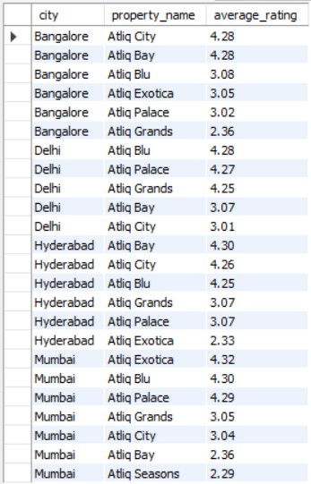

#### The average hotel ratings vary notably across cities and properties. In Bangalore, AtliQ City and AtliQ Bay lead with strong ratings (4.28), while AtliQ Grands records the lowest (2.36). In Delhi, overall ratings are relatively strong, with AtliQ Blu (4.28) and AtliQ Palace (4.27) performing best. Hyderabad shows mixed performance, where AtliQ Bay achieves the highest rating (4.30), but AtliQ Exotica lags significantly at 2.33. In Mumbai, AtliQ Exotica (4.32) and AtliQ Blu (4.30) are top-rated, whereas AtliQ Seasons (2.29) and AtliQ Bay (2.36) underperform. Overall, while several properties maintain strong customer satisfaction above 4.0, a few consistently low-rated hotels may require service quality improvements to enhance brand perception.

1️⃣7️⃣ __Is there a correlation between ratings and revenue performance?__

```
SELECT
	ratings_given,
    ROUND(AVG(revenue_realised),2) AS avg_revenue,
    COUNT(booking_id) AS booking_count
FROM fact_bookings
WHERE ratings_given IS NOT NULL
GROUP BY ratings_given
ORDER BY avg_revenue DESC;
```

__Result__

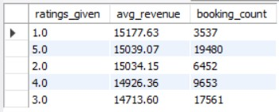

#### The data suggests a moderate positive relationship between ratings and revenue performance, though it is not perfectly linear. Higher ratings such as 5.0 (15,039 avg revenue) and 4.0 (14,926 avg revenue) are associated with relatively strong revenue per booking, supported by substantial booking volumes. However, the 1.0 rating shows the highest average revenue (15,177) despite having the lowest booking count, indicating that a few high-value bookings may be skewing the average. Meanwhile, mid-range ratings (2.0 and 3.0) generate comparatively lower average revenue. Overall, while better ratings generally align with stronger revenue performance, revenue is also influenced by booking volume and pricing factors, not ratings alone.

1️⃣8️⃣ __Which hotels generate high revenue but have low ratings?__

```
WITH hotel_metrics AS
(
	SELECT
		dh.property_id,
		dh.property_name,
		SUM(fb.revenue_realised) AS revenue,
        ROUND(AVG(ratings_given),2) AS avg_ratings
	FROM dim_hotels AS dh
	JOIN fact_bookings AS fb
	ON dh.property_id = fb.property_id
    WHERE ratings_given IS NOT NULL
	GROUP BY dh.property_id, dh.property_name
),
benchmarks AS
(
	SELECT
		ROUND(AVG(revenue),2) AS average_revenue,
        ROUND(AVG(avg_ratings),2) AS average_ratings
	FROM hotel_metrics
)
SELECT
	hm.property_name,
    hm.revenue,
    hm.avg_ratings
FROM hotel_metrics AS hm
CROSS JOIN benchmarks AS b
WHERE  hm.revenue > b.average_revenue
AND hm.avg_ratings < b.average_ratings
ORDER BY hm.revenue DESC;
```

__Result__

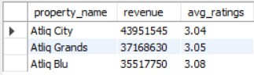

#### The analysis indicates that AtliQ City generates the highest revenue (43,951,545) despite maintaining a relatively low average rating of 3.04. Similarly, AtliQ Grands (37,168,630 revenue, 3.05 rating) and AtliQ Blu (35,517,750 revenue, 3.08 rating) also deliver strong revenue performance while having moderate customer ratings. This suggests that these properties benefit from strong demand or strategic location advantages, but service quality improvements could further enhance customer satisfaction and long-term brand value.

1️⃣9️⃣ __Rank hotels by revenue within each city.__

```
SELECT
	dh.city,
    dh.property_name,
    SUM(fb.revenue_realised) AS revenue,
    RANK() OVER(PARTITION BY dh.city ORDER BY SUM(fb.revenue_realised) DESC) AS rnk
FROM dim_hotels AS dh
JOIN fact_bookings AS fb
ON dh.property_id = fb.property_id
GROUP BY dh.city, dh.property_id, dh.property_name;
```

__Result__

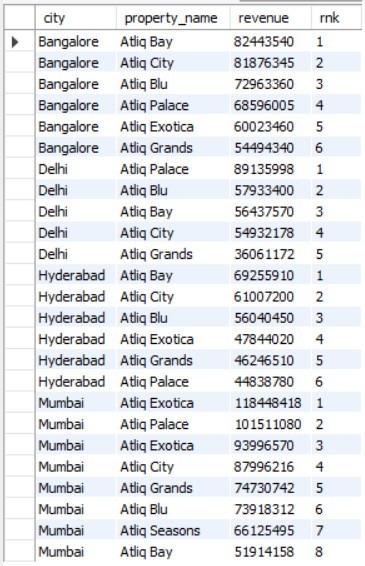

#### The revenue ranking reveals clear performance leaders within each city. In Bangalore, AtliQ Bay ranks first, followed by AtliQ City and AtliQ Blu, while AtliQ Grands records the lowest revenue. In Delhi, AtliQ Palace leads by a significant margin, with AtliQ Blu and AtliQ Bay following behind. In Hyderabad, AtliQ Bay secures the top position, whereas AtliQ Palace ranks last. In Mumbai, AtliQ Exotica dominates revenue generation, followed by AtliQ Palace, while AtliQ Bay and AtliQ Seasons appear among the lower-ranked properties. Overall, revenue concentration within each city highlights a few dominant performers, suggesting strong brand positioning or demand advantage in specific properties.

2️⃣0️⃣ __Identify top 3 revenue-generating hotels per city.__

```
WITH city_metrics AS
(
SELECT
	dh.city,
    dh.property_name,
    SUM(fb.revenue_realised) AS revenue,
    RANK() OVER(PARTITION BY dh.city ORDER BY SUM(fb.revenue_realised) DESC) AS rnk
FROM dim_hotels AS dh
JOIN fact_bookings AS fb
ON dh.property_id = fb.property_id
GROUP BY dh.city, dh.property_id, dh.property_name
)
SELECT
	city,
    property_name,
    rnk
FROM city_metrics
WHERE rnk IN (1,2,3);
```
__Result__

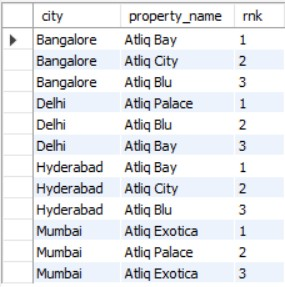

#### The top three revenue-generating hotels vary by city but show consistent performance leaders. In Bangalore, the top performers are AtliQ Bay (1st), AtliQ City (2nd), and AtliQ Blu (3rd). In Delhi, AtliQ Palace leads, followed by AtliQ Blu and AtliQ Bay. For Hyderabad, AtliQ Bay, AtliQ City, and AtliQ Blu secure the top three positions. In Mumbai, AtliQ Exotica ranks first, AtliQ Palace second, and AtliQ Exotica appears again in the third position as per the ranking data. Overall, certain properties like AtliQ Bay and AtliQ Blu consistently appear among the top performers across multiple cities, indicating strong brand competitiveness and revenue strength.

2️⃣1️⃣ __Calculate Month-over-Month revenue growth %.__

```
WITH revenue_trends AS
(
	SELECT
		MONTH(dd.date) AS month_no,
		MONTHNAME(dd.date) AS month_name,
		SUM(fb.revenue_realised) AS revenue,
		LAG(SUM(fb.revenue_realised)) OVER(ORDER BY MONTH(dd.date)) AS prev_month_revenue
    FROM dim_date_clean AS dd
    JOIN fact_bookings AS fb
    ON dd.date = fb.booking_date
    GROUP BY month_no, month_name
)
SELECT
	month_name,
    revenue,
    prev_month_revenue,
    ROUND(
		((revenue - prev_month_revenue) / prev_month_revenue) * 100,2
        ) AS revenue_growth_pct
FROM revenue_trends 
ORDER BY month_no;
```

__Result__

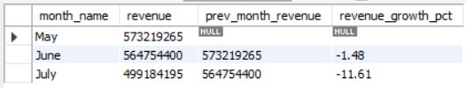

#### The Month-over-Month (MoM) analysis shows a declining revenue trend over the observed period. Revenue decreased by 1.48% in June compared to May, indicating a slight slowdown in performance. The decline intensified in July, with revenue dropping by 11.61% compared to June, reflecting a significant contraction. Overall, the consistent negative growth suggests weakening demand or seasonal factors impacting revenue generation across consecutive months.

2️⃣2️⃣ __Which hotels have high capacity but low RevPAR?__

```
WITH revenue_metrics AS
(
	SELECT
		dh.property_id,
		dh.property_name,
		SUM(fb.revenue_realised) AS revenue
	FROM dim_hotels AS dh  
	JOIN fact_bookings AS fb
	ON dh.property_id = fb.property_id 
	GROUP BY dh.property_id, dh.property_name
),
capacity_metrics AS
(
	SELECT
		property_id,
        SUM(capacity) AS capacity
	FROM fact_aggregated_bookings
    GROUP BY property_id
),
hotel_metrics AS
(
	SELECT
		rm.property_id,
        rm.property_name,
        rm.revenue,
        cm.capacity,
        ROUND(rm.revenue / cm.capacity,2) AS revpar
	FROM revenue_metrics AS rm
    JOIN capacity_metrics AS cm
    ON rm.property_id = cm.property_id			
),
benchmarks AS
(
	SELECT
		AVG(capacity) AS average_capacity,
        AVG(revpar) AS average_revpar
	FROM hotel_metrics
)
SELECT
	hm.property_id,
	hm.property_name,
    hm.capacity,
	hm.revenue,
    hm.revpar
FROM hotel_metrics AS hm
CROSS JOIN benchmarks AS b
WHERE hm.capacity > b.average_capacity
AND hm.revpar < b.average_revpar
ORDER BY hm.capacity DESC, hm.revpar;
```

__Result__

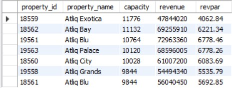

#### The analysis highlights that AtliQ Exotica (capacity: 11,776, RevPAR: 4,062.84) has the highest room capacity but relatively low RevPAR, indicating underperformance in revenue generation per available room. Similarly, AtliQ Grands (capacity: 9,844, RevPAR: 5,535.79) also shows comparatively lower RevPAR despite maintaining substantial capacity. In contrast, properties like AtliQ Blu and AtliQ Palace achieve significantly higher RevPAR (above 6,700) with slightly lower capacity levels. This suggests that certain high-capacity hotels may not be optimizing pricing or occupancy effectively, leaving room for revenue management improvements.

2️⃣3️⃣ __Calculate key KPIs:•	ADR • RevPAR • Occupancy %__

```
WITH revenue_metrics AS
(
	SELECT
		SUM(revenue_realised) AS revenue
    FROM fact_bookings
),
hotel_metrics AS
(
	SELECT
		SUM(successful_bookings) AS rooms_sold,
        SUM(capacity) AS capacity
    FROM fact_aggregated_bookings
)
SELECT
	ROUND(r.revenue / h.rooms_sold,2) AS ADR,
    ROUND(r.revenue / h.capacity,2) AS RevPAR,
    ROUND((h.rooms_sold /  h.capacity)*100,2) AS Occupancy_pct
FROM revenue_metrics AS r
CROSS JOIN hotel_metrics AS h;
```

__Result__

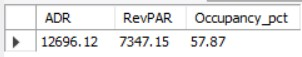

#### The overall performance metrics indicate a healthy but improvable operational position. The Average Daily Rate (ADR) stands at 12,696.12, reflecting the average revenue earned per occupied room. The RevPAR (Revenue per Available Room) is 7,347.15, capturing both pricing and occupancy efficiency. Meanwhile, the Occupancy Rate is 57.87%, meaning slightly more than half of the total room inventory is utilized. Together, these KPIs suggest stable pricing power but moderate room utilization, indicating potential scope to improve occupancy to further enhance overall revenue performance.

2️⃣4️⃣ __Which city delivers the highest RevPAR?__

```
WITH revenue_metrics AS
(
	SELECT
		dh.city,
		SUM(revenue_realised) AS revenue
    FROM dim_hotels AS dh
    JOIN fact_bookings AS fb
    ON dh.property_id = fb.property_id
    GROUP BY dh.city
),
capacity_metrics AS
(
	SELECT
		dh.city,
        SUM(fab.capacity) AS capacity
	FROM dim_hotels AS dh
    JOIN fact_aggregated_bookings AS fab
    ON dh.property_id = fab.property_id
    GROUP BY dh.city
)
SELECT
	r.city,
    ROUND(r.revenue / c.capacity,2) AS RevPAR
FROM revenue_metrics AS r 
JOIN capacity_metrics AS c
ON r.city = c.city
ORDER BY RevPAR DESC;
```

__Result__

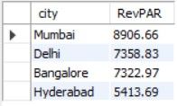

#### The analysis shows that Mumbai delivers the highest RevPAR at 8,906.66, indicating the strongest revenue generation per available room among all cities. It is followed by Delhi (7,358.83) and Bangalore (7,322.97), which perform at relatively similar levels. In contrast, Hyderabad records the lowest RevPAR at 5,413.69, suggesting comparatively weaker pricing power or occupancy efficiency. Overall, Mumbai stands out as the most revenue-efficient market in terms of room utilization and pricing performance.

2️⃣5️⃣ __Based on revenue, occupancy rate, RevPAR, and customer ratings, which cities should AtliQ prioritize for further investment?__

```
 WITH metrics1 AS 
 (
	SELECT
		dh.city,
        SUM(fb.revenue_realised) AS revenue,
        ROUND(AVG(fb.ratings_given),2) AS customer_ratings
	FROM dim_hotels AS dh
    JOIN fact_bookings AS fb
    ON dh.property_id = fb.property_id
    GROUP BY dh.city
 ),
 metrics2 AS
 (
	SELECT
		dh.city,
        ROUND(
        (SUM(fab.successful_bookings) / SUM(fab.capacity))*100,2
        ) AS occupancy_rate,
        ROUND(
        MAX(m1.revenue) / SUM(fab.capacity),2
        ) AS RevPAR
	FROM dim_hotels AS dh
    JOIN fact_aggregated_bookings AS fab
    ON dh.property_id = fab.property_id
    JOIN metrics1 AS m1
    ON dh.city = m1.city
    GROUP BY dh.city
 ),
 benchmarks AS
 (
	SELECT
		AVG(m1.revenue) AS avg_revenue,
        AVG(m2.occupancy_rate) AS avg_occupancy_rate,
        AVG(m2.RevPAR) AS avg_RevPAR,
        AVG(m1.customer_ratings) AS avg_customer_ratings
	FROM metrics1 AS m1
    JOIN metrics2 AS m2
    ON m1.city = m2.city
 )
 SELECT
	m1.city,
    m1.revenue,
    CASE WHEN m1.revenue > b.avg_revenue THEN 'OK' ELSE 'NOT OK' 
    END AS revenue_status,
    m2.occupancy_rate,
    CASE WHEN m2.occupancy_rate > b.avg_occupancy_rate THEN 'OK' ELSE 'NOT OK' 
    END AS occupancy_rate_status,
    m2.RevPAR,
    CASE WHEN m2.RevPAR > b.avg_RevPAR THEN 'OK' ELSE 'NOT OK' 
    END AS RevPAR_status,
    m1.customer_ratings,
    CASE WHEN m1.customer_ratings > b.avg_customer_ratings THEN 'OK' ELSE 'NOT OK' 
    END AS customer_ratings_status,
    (
		CASE WHEN m1.revenue > b.avg_revenue THEN 1 ELSE 0 END +
        CASE WHEN m2.occupancy_rate > b.avg_occupancy_rate THEN 1 ELSE 0 END +
        CASE WHEN m2.RevPAR > b.avg_RevPAR THEN 1 ELSE 0 END +
        CASE WHEN m1.customer_ratings > b.avg_customer_ratings THEN 1 ELSE 0 END 
	) AS kpi_score,
    CASE
		WHEN
			(
				CASE WHEN m1.revenue > b.avg_revenue THEN 1 ELSE 0 END +
				CASE WHEN m2.occupancy_rate > b.avg_occupancy_rate THEN 1 ELSE 0 END +
				CASE WHEN m2.RevPAR > b.avg_RevPAR THEN 1 ELSE 0 END +
				CASE WHEN m1.customer_ratings > b.avg_customer_ratings THEN 1 ELSE 0 END
			) >=3 THEN 'invest'
		WHEN
			(
				CASE WHEN m1.revenue > b.avg_revenue THEN 1 ELSE 0 END +
				CASE WHEN m2.occupancy_rate > b.avg_occupancy_rate THEN 1 ELSE 0 END +
				CASE WHEN m2.RevPAR > b.avg_RevPAR THEN 1 ELSE 0 END +
				CASE WHEN m1.customer_ratings > b.avg_customer_ratings THEN 1 ELSE 0 END
			) =2 THEN 'improve'
		ELSE 'do not invest' 
        END AS investment_decision
FROM metrics1 AS m1
JOIN metrics2 AS m2
ON m1.city = m2.city
CROSS JOIN benchmarks AS b
ORDER BY kpi_score DESC ;
```

__Result__

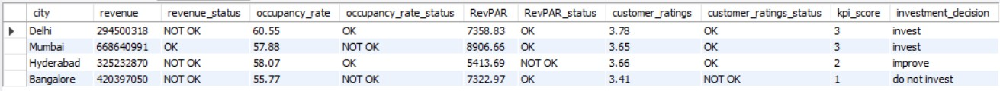

#### Based on the combined KPI evaluation, Mumbai and Delhi should be prioritized for further investment. Mumbai demonstrates strong overall performance with the highest revenue and RevPAR, despite slightly lower occupancy, resulting in a solid KPI score and “invest” recommendation. Delhi also shows stable occupancy, healthy RevPAR, and balanced customer ratings, making it a viable market for expansion. In contrast, Hyderabad requires performance improvement due to weaker RevPAR despite moderate occupancy, while Bangalore ranks lowest overall, with weaker occupancy and customer ratings, leading to a “do not invest” recommendation. Overall, capital allocation should focus on high-performing, revenue-efficient markets like Mumbai and Delhi to maximize returns.
